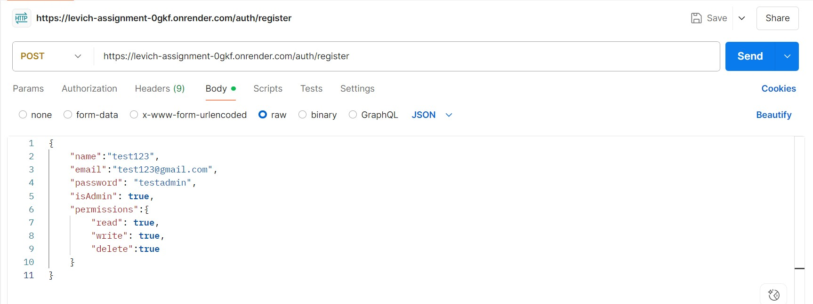

# Authentication and Comment Permission Service

A backend service that handles user authentication, authorization, session management, and comment-level access control using role-based permissions.

## Features

- User authentication (register/login)
- JWT token system with access/refresh tokens
- Password reset flow
- Role-based permissions (read, write, delete)
- Comments CRUD operations with permission checks
- API documentation with Swagger

## Technologies

- Node.js
- Express
- MongoDB (with Mongoose)
- JWT for authentication
- Jest for testing

## Setup

1. Clone the repository
2. Install dependencies: `npm install`
3. Set up environment variables in `.env` file
4. Start MongoDB server
5. Run the app: `npm start`

## POSTMAN images

# 1. Register User



# 2. Login User


# 3. Refresh Token


# 4. Logout


# 5. Forgot Password


# 6. Reset Password


# 7. Create Comment


# 8. Get Comments


## 9. Update User Permissions (Admin Only)

**Method:** `PATCH`  
**URL:** `https://levich-assignment-0gkf.onrender.com/permissions/:userId`  
_Replace `:userId` with the target user's ID_

### Headers
- `Content-Type: application/json`  
- `Authorization: Bearer <admin-access-token-here>`

### Request Body Example

```json
{
  "permissions": {
    "read": true,
    "write": true,
    "delete": false
  },
  "isAdmin": true
}
```
